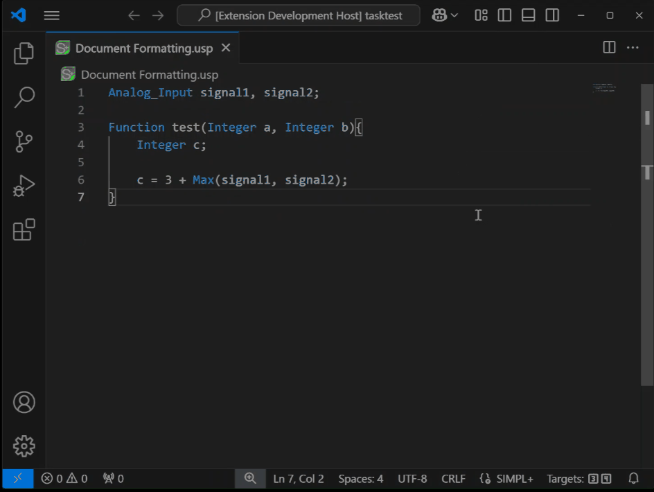
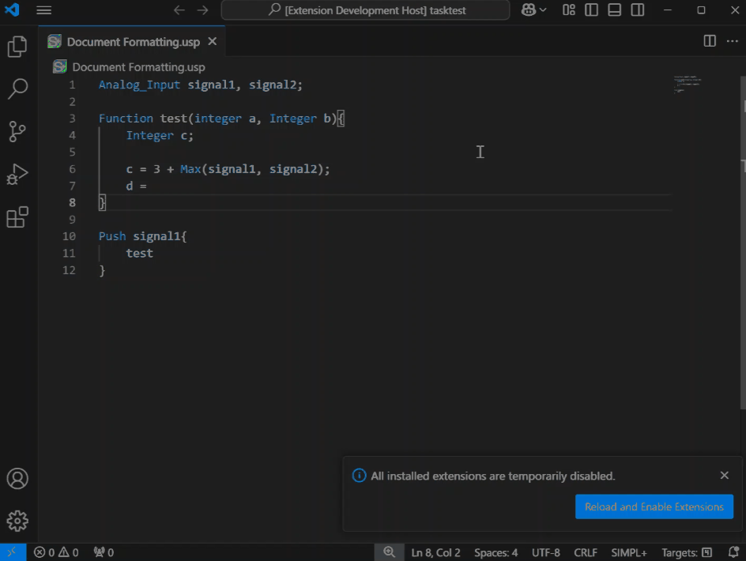

This is a language package for programming Crestron SIMPL+ module. It features:
*  Complete language syntax highlighting for SIMPL+ files and API files
*  Document formatting with
    *   Indentation
    *   [Brace Line ( {} ) formatting](#brace-line)
        *   Same Line as block name
        *   New line under block name
    *   [Capitalization for keywords with options for](#keyword-case)
        *   lowercase
        *   UPPERCASE
        *   PascalCase
        *   Leave Untouched
*  [Full support of VS Code Build Task](#vs-code-build-task-support)
    *   Autodetects workspaces with USP and [suggest relevant SIMPL+ Build Task](https://code.visualstudio.com/docs/editor/tasks#_task-autodetection) 
    *   Create your own [Custom Build task](https://code.visualstudio.com/docs/editor/tasks#_custom-tasks) for one or many SIMPL+ files through VS Code tasks.json
*  [Support for building current file using F12, or force build using Shift+F12.](#target-build-of-a-single-file)
*  Remembers build targets from previously build SIMPL+ files the same way Crestron's SIMPL+ IDE does.
*  [Hover over help for SIMPL+ functions, leveraging the SIMPL+ online help file.](#hover-over-help)
*  [Context Sensitive Autocomplete](#context-sensitive-autocomplete) support for local variables, functions, SIMPL# classes and enums, SIMPL+ library functions, keywords, and built-in functions.
*  [Function Signature Helper](#function-signature-helper)
*  [SIMPL+ category insertion through right click context menu](#simpl-category-insertion)
*  [Automatic API file generation for SIMPL# libraries](#api-auto-build-and-auto-complete)
*  Snippets for many SIMPL+ functions

The extension also add teh following:
* [Extension Commands](#extension-commands)
* [Extension Settings](#extension-settings)
* [Keybindings and Menus](#keybindings-and-menus)


## Autoformatting

The extension provides autoformatting for SIMPL+ files. The following settings are available:


### Brace Line

Configure your preferred brace line style. Default is `Same Line`. Options are `Same Line` and `New Line`.


### Keyword Case

Configure your preferred case for keywords, statements, etc. Default is `Unchanged`. Options are `Lowercase`, `UPPERCASE`, `PascalCase`, and `Unchanged`.


## VS Code Build Task Support

Create one or many custom build task using the VS Code tasks.json file. The extension will automatically detect the workspace and suggest the relevant SIMPL+ build task.


Modify the tasks.json file to include 1 or many files.  The json file schema is as follows:

```json
{
	"version": "2.0.0",
	"tasks": [
		{
			"type": "simpl-plus",
			"buildTypes": [
				"Series4"
			],
			"files": [
				"Document Formatting.usp"
			],
			"directory": "c:\\Users\\WDAGUtilityAccount\\Documents\\workspace",
			"rebuild": false,
			"problemMatcher": [
				"$SIMPL+"
			],
			"group": {
				"kind": "build",
				"isDefault": true
			},
			"label": "simpl-plus: Compile 4 Series"
		}
	]
}
```

* `type`: must always be `simpl-plus`
* `buildTypes`: Array of build targets to build the file with.  Options are `Series2`, `Series3`, and `Series4`
* `files`: Array of files to build, just the file name, not the full path
* `directory`: The directory where the file is located
* `rebuild`: If true, will force a rebuild of the file
* `problemMatcher`: Must always be `$SIMPL+`
* `group`: Must always be `build` and `isDefault` must be true
* `label`: The name of the task that will show up in the task list

A json file like this:

```json
{
	"version": "2.0.0",
	"tasks": [
		{
			"type": "simpl-plus",
			"buildTypes": [
				"Series3"
			],
			"files": [
				"series3 document.usp"
			],
			"directory": "c:\\Users\\WDAGUtilityAccount\\Documents\\workspace",
			"rebuild": true,
			"problemMatcher": [
				"$SIMPL+"
			],
			"group": {
				"kind": "build",
				"isDefault": true
			},
			"label": "simpl-plus: Will build my series 3 document"
		},
		{
			"type": "simpl-plus",
			"buildTypes": [
				"Series4"
			],
			"files": [
				"series4 document 1.usp",
				"series4 document 2.usp"
			],
			"directory": "c:\\Users\\WDAGUtilityAccount\\Documents\\workspace",
			"rebuild": false,
			"problemMatcher": [
				"$SIMPL+"
			],
			"group": {
				"kind": "build",
				"isDefault": true
			},
			"label": "simpl-plus: Will Build 2 of my series 4 documents"
		}
	]
}
```

will show up when pressing ctrl+shift+b like this


The first option will launch a terminal command:

```shell
"C:\Program Files (x86)\Crestron\Simpl\SPlusCC.exe" "\rebuild" "series3 document.usp" "\target" "series3"
```

the second will look like this:

```shell
"C:\Program Files (x86)\Crestron\Simpl\SPlusCC.exe" "\build" "series4 document 1.usp" "series4 document 2.usp" "\target" "series4"
```

## Target Build of a single file

Easily change the target of a single file by clicking on the target in the status bar.  The target will be saved using the same mechanism as Crestron's SIMPL+ IDE.  And next time the document is open the settings will be persevered. Build the currently open file by pressing F12, or force a build by pressing Shift+F12.



## Hover Over Help

Online help is provided for SIMPL+ functions.  Hover over a function to see the help. (not all functions or keywords have help)


## Context Sensitive AutoComplete

The extension will suggest possible completions depending on the context the cursor is in. For example it will not suggest functions if the cursor is inside a structure block, or will only suggest variable type if it is inside the parameters section of a function.


## Function Signature Helper

Provides help in filling in arguments for Built-in as well as User Defined functions.


## SIMPL+ category insertion 

Insert a SIMPL+ category at the beginning of the file by right clicking in the editor and selecting `Insert Category`.



## API Auto build and Auto Complete

Drag a SIMPL# Library (*.CLZ) to the project folders, reference it in the SIMPL+ file, and the extension will automatically generate the API file. Open if using the right click context menu.  The  extension will then suggest completions for the library functions.


The extension is also aware of referenced SIMPL+ libraries and will suggest functions and structures from them.

## Extension Commands

This extension contributes the following commands:

* `simpl-plus.localHelp`: Opens the local SIMPL+ help reference file
* `simpl-plus.webHelp`: Opens the online SIMPL+ help reference page
* `simpl-plus.build`: Builds the current SIMPL+ file
* `simpl-plus.insertCategory`: Inserts a SIMPL+ category at the beginning of the file
* `simpl-plus.openApis`: Open all project related API files
* `simpl-plus.openLibraries`: Open all project related library files

## Extension Settings

This extension contributes the following settings:

* `simpl-plus.enable2series`: Enables Series 2 build target for new or unknown SIMPL+ files. Default is false.
* `simpl-plus.enable3series`: Enables Series 3 build target for new or unknown SIMPL+ files. Default is true.
* `simpl-plus.enable4series`: Enables Series 4 build target for new or unknown SIMPL+ files. Default is true.
* `simpl-plus.simplDirectory`: Location of the Crestron SIMPL Directory. Default is `C:\Program Files (x86)\Crestron\Simpl`
* `simpl-plus.keywordCase`: Case used when performing autoformat of built-in keywords, statements, etc. Default is `Unchanged`
* `simpl-plus.braceLine`: If enable it will add a new line before every opening curly bracket.  If not, it will move it to the end of the previous line. Default is false

## Keybindings and Menus

All commands are added to the right click context menu of the editor tab, and the following keybindings have been added.

* `ctrl+shift+F1`: Opens the local SIMPL+ help reference file
* `ctrl+shift+F2`: Opens the online SIMPL+ help reference page
* `F12`: Builds the current SIMPL+ file
* `shift+F12`: Re-Builds the current SIMPL+ file
